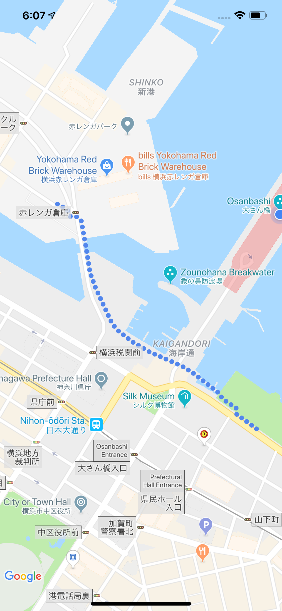

# NJCircleLine

Wanna draw a dot line like the one in Google Map? Use NJCircleLine! :-)
This library provide you a simple interface to be able to draw route navigation like dot lines. Not only it can draw straight linear lines with a collection of dots, it could also hit the Google Direcrtion API on your behalf and draw the returned route with dot lines as long as a configuration if provided.
This library also provide you interface to redraw/resize your lines in case of map camera zoom changes.



## Example

To run the example project, clone the repo, and run `pod install` from the Example directory first.

## Requirements

Since this lib depends on Google Map SDK, you have to register your app to which you want to embed this library with Google Map service and abtain the required API key before running.
If a linear line is everything you need, a Google Map service key is enough. However if you want draw the route with the result of Google Direction API, you need to provide Direction API Key as well.

## Installation

NJCircleLine is available through [CocoaPods](https://cocoapods.org). To install
it, simply add the following line to your Podfile:

```ruby
pod 'NJCircleLine'
```

## Usage
The basic usage is very simple. Every method provided in this library is static method so you don't need to create an instance. Simply feed the required information to the method and you are good to go.
```swift
// Example for drawing travel line.
// Travel line is the mode that you provide start and end point and the lib will hit Google Direction API and draw the route for you

// Create points
let startPoint = CLLocationCoordinate2D(latitude: 35.452006, longitude: 139.641474)
let endPoint = CLLocationCoordinate2D(latitude: 35.446697, longitude: 139.647305)

// Call the method, done. (read more if you need further control)        
NJCircleLine.drawTravelLine(from: startPoint, 
                            to: endPoint,
                            on: mapView,
                            apiKey: Constant.DirectionKey)
```


## Author

Jin Nagumo

## License

NJCircleLine is available under the MIT license. See the LICENSE file for more info.
