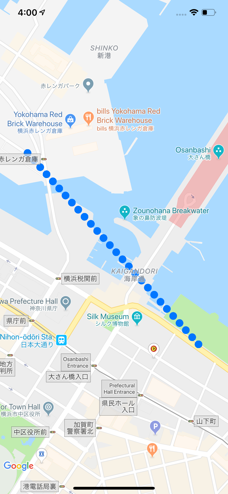
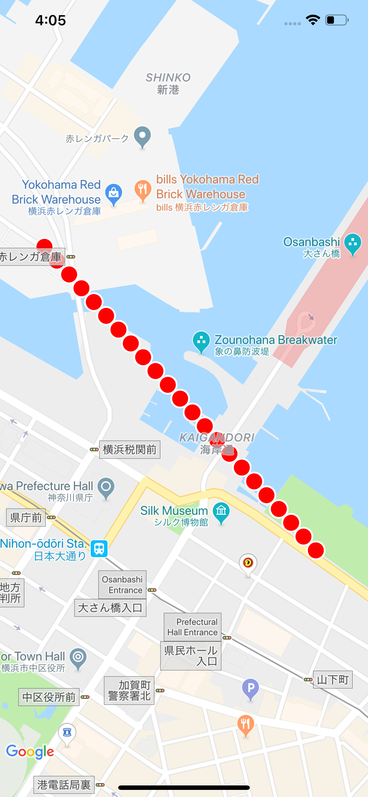

# NJCircleLine

Wanna draw a dot line like the one in Google Map? Use NJCircleLine! :-)  
This library provide you a simple interface to draw route-navigation-like dot lines. Not only it can draw straight linear lines with a collection of dots, it could also hit the Google Direcrtion API on your behalf and draw the returned route with dot lines as long as a configuration if provided.
This library also provide you interface to redraw/resize your lines in case of map camera zoom changes.


## Example

To run the example project, clone the repo, and run `pod install` from the Example directory first.

## Requirements

Since this lib depends on Google Map SDK, you have to register your app to which you want to embed this library with Google Map service and abtain the required API key before running.  
If a linear line is everything you need, a Google Map service key is enough. However if you want draw the route with the result of Google Direction API, you need to provide Direction API Key as well.

## Installation

NJCircleLine is available through [CocoaPods](https://cocoapods.org). To install
it, simply add the following line to your Podfile:

```ruby
pod 'NJCircleLine'
```

## Usage
### Basic Usage
The basic usage is very simple. Every method provided in this library is static method so you don't need to create an instance. Simply feed the required information to the method and you are good to go.
```swift
// Example for drawing travel line.
// Travel line is the mode that you provide start and end point and the lib will hit Google Direction API and draw the route for you

// Create points
let startPoint = CLLocationCoordinate2D(latitude: 35.452006, longitude: 139.641474)
let endPoint = CLLocationCoordinate2D(latitude: 35.446697, longitude: 139.647305)

// Call the drawTravelLine method, done. (read more if you need further control)        
NJCircleLine.drawTravelLine(from: startPoint, 
                            to: endPoint,
                            on: mapView,
                            apiKey: "YOUR GOOGLE DIRECTION API KEY",
                            completion: nil)
```


Drawing a linear line is even more simple.
```swift
// Example for drawing linear line.
// Linear line is the mode that you provide multiple points and the lib will connect them with dot line

// Create points
let point1 = CLLocationCoordinate2D(latitude: 35.452006, longitude: 139.641474)
let point2 = CLLocationCoordinate2D(latitude: 35.446697, longitude: 139.647305)

// Call the method        
NJCircleLine.drawLinearLine(points: [point1, point2],
                            on: mapView,
                            completion: nil)
```


You can also specify a visual configuration object and feed it to the draw methods.
```swift
// Create a configuration object
var config = NJCircleLineConfiguration()
config.fillColor = UIColor.red
config.strokeWidth = 2.0
config.strokeColor = UIColor.white // Note that it only takes effect when a non-zero strokeWidth is specified
config.minimumInterval = 1.0 // interval between 2 circles
config.circleRadius = 10.0

// Call the method and feed the configuration object     
NJCircleLine.drawLinearLine(points: [point1, point2],
                            on: mapView,
                            configuration: config,
                            completion: nil)
```


### Advanced Control
If you map view doesn't support gestures, especially zoom, then in most cases it should be enough with above usages. However, if you are enabling zoom in your map view, the circles once drawn in the map need to be eliminated and redrawn to match the map camera.  

Fortunately doing this is not that complicated, all you need to do is to hold the path and reference of the array of circles returned by NJCircleLine methods.  
```swift
class NJMapViewController: ViewController {
    var circles = [GMSCircle]()
    var path: GMSPath? = nil

    func draw() {
        // Grab the reference in the completion block
        NJCircleLine.drawTravelLine(from: startPoint,
                                    to: endPoint,
                                    on: mapView,
                                    apiKey: "YOUR GOOGLE DIRECTION API KEY") { [weak self] (path, circles, _, _, _) in
                self?.circles = circles
                self?.path = path
        }
    }

    // Once you have the references, you just use them to redraw the line at the desired timing.
    // If you wanna achieve what the iOS Google Map app is doing, I recommend doing in the mapViewDidChangePosition delegate method of GMSMapView.
    func mapView(_ mapView: GMSMapView, didChange position: GMSCameraPosition) {
        // Pass the path and cirles to the low level drawDotLine method.
        // Don't forget to get the new reference of circles while calling this method.
        circles = NJCircleLine.drawDotLine(path: travelPath, on: mapView, previousCircles: circles)
    }
}
```

That's it! Hope you can enjoy it! :-)

## Author

Jin Nagumo

## License

NJCircleLine is available under the MIT license. See the LICENSE file for more info.
